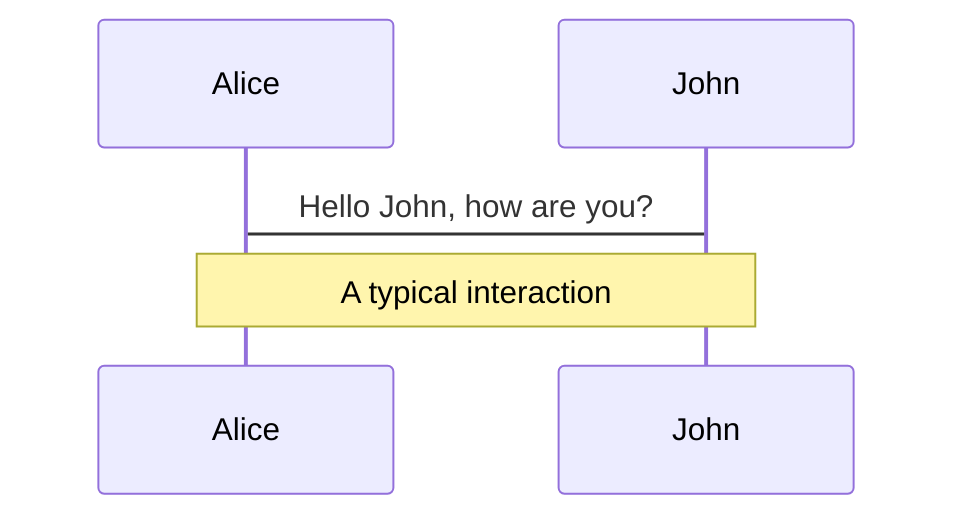
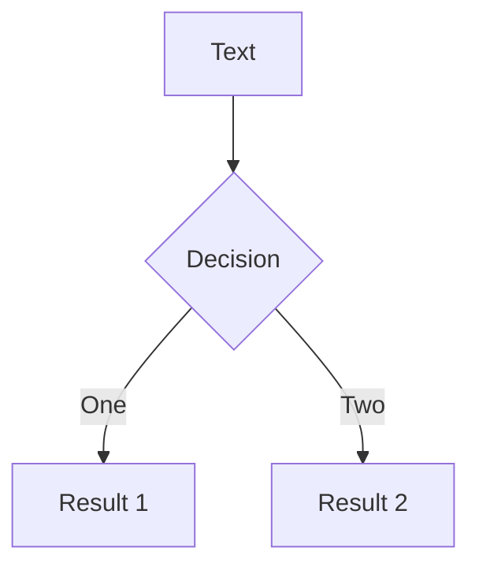
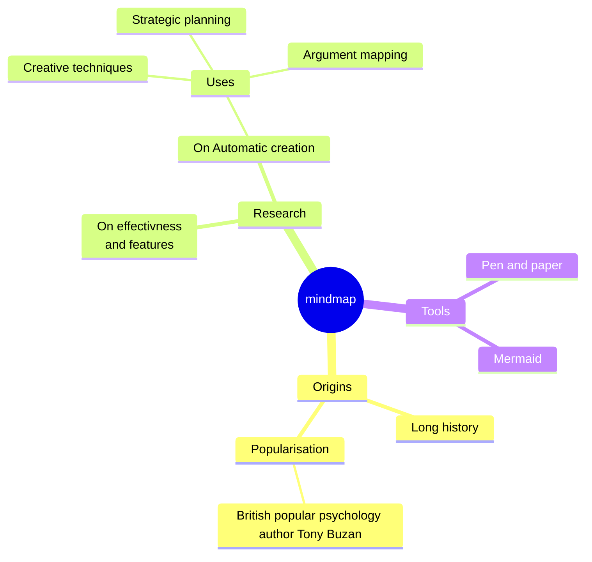
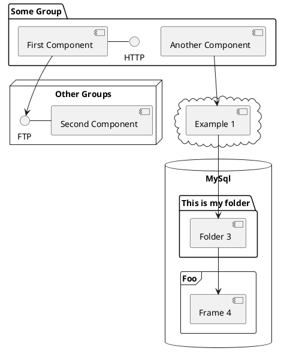

# The power of Piston

Code execution engine

---
transition: slide-left
---

# What is Code execution engine

<br>

### Code execution engine (CEE) is a service that interprets and executes programming code written in various programming languages.

Some key aspects :

- 🛡️ **Isolation**
- 🎛️🔢 **Version Control**
- 📚🔗 **APIs and Integrations**
- 🛠️ **Language Support**
- 🔒 **Security**
- 💾 **Resource Management**
- 🏞️ **Execution Environment**
- 🪅 **Others...**
<!--
To describe Piston we will start by describing what is a code execution engine. So a code execution engine is a service that interprets and executes code written in any programming language.

The main task is to provide an environment in which code can be executed safely and efficiently.
The primary purpose of a Code Execution Engine is to run user code securely and with some kind of reliability.

As you can see we have here some key aspects that a code execution engine should have.

- Isolation : providing isolation will ensure that the executed code cannot harm the system or other running processes
- Version Control: Some code execution engine might support multiple programming language versions.
- APIs and Integrations: Allow the use of this feature in other software like online code editors.
- Language Support: allow multiple programming languages (compiled, functional and so on)
- Security: This one is imported, if not the most imported one. The engine needs to be secure while running code, because sometimes the code can be extraordinarily hostile and harmful.
- Resource Management: Also an imported aspect, because running code can take a lot of resources, and if it is bad code it can be even worse. So we need a good way to manage the system resources
- Execution Environment: We need a runtime environment for each code execution, which includes loading necessary libraries, providing standard input/output stream also handling errors on runtime.
-->

---
transition: slide-left
layout: image-right
image: https://raw.githubusercontent.com/engineer-man/piston/master/var/docs/images/piston.svg
---


# What is Piston?

code execution engine

<br>

## Piston is a high performance code execution engine that can be used to run source code on the web.

<br>
<br>

You can see more about Piston [here](https://github.com/engineer-man/piston)

<!--
This is where Piston comes in

So Piston is a high performance code execution engine that can be used to run any source code on the web.
-->

---
transition: slide-left
---

# Piston

Design goals && some bumps 


<!--
The main goal of piston was to run the code fast and securely


-->

---
layout: image-right
image: https://source.unsplash.com/collection/94734566/1920x1080
---

# Different accesses

Use code snippets and get the highlighting directly![^1]

```ts {all|2|1-6|9|all}
interface User {
  id: number
  firstName: string
  lastName: string
  role: string
}

function updateUser(id: number, update: User) {
  const user = getUser(id)
  const newUser = { ...user, ...update }
  saveUser(id, newUser)
}
```

<arrow v-click="3" x1="400" y1="420" x2="230" y2="330" color="#564" width="3" arrowSize="1" />

[^1]: [Learn More](https://sli.dev/guide/syntax.html#line-highlighting)

<style>
.footnotes-sep {
  @apply mt-20 opacity-10;
}
.footnotes {
  @apply text-sm opacity-75;
}
.footnote-backref {
  display: none;
}
</style>

---

# Components

<div grid="~ cols-2 gap-4">
<div>

You can use Vue components directly inside your slides.

We have provided a few built-in components like `<Tweet/>` and `<Youtube/>` that you can use directly. And adding your custom components is also super easy.

```html
<Counter :count="10" />
```

<!-- ./components/Counter.vue -->
<Counter :count="10" m="t-4" />

Check out [the guides](https://sli.dev/builtin/components.html) for more.

</div>
<div>

```html
<Tweet id="1390115482657726468" />
```

<Tweet id="1390115482657726468" scale="0.65" />

</div>
</div>

<!--
Presenter note with **bold**, *italic*, and ~~striked~~ text.

Also, HTML elements are valid:
<div class="flex w-full">
  <span style="flex-grow: 1;">Left content</span>
  <span>Right content</span>
</div>
-->


---
class: px-20
---

# Themes

Slidev comes with powerful theming support. Themes can provide styles, layouts, components, or even configurations for tools. Switching between themes by just **one edit** in your frontmatter:

<div grid="~ cols-2 gap-2" m="-t-2">

```yaml
---
theme: default
---
```

```yaml
---
theme: seriph
---
```


</div>

Read more about [How to use a theme](https://sli.dev/themes/use.html) and
check out the [Awesome Themes Gallery](https://sli.dev/themes/gallery.html).

---
preload: false
---

# Animations

Animations are powered by [@vueuse/motion](https://motion.vueuse.org/).

```html
<div
  v-motion
  :initial="{ x: -80 }"
  :enter="{ x: 0 }">
  Slidev
</div>
```

<div class="w-60 relative mt-6">
  <div class="relative w-40 h-40">
    
    
    
  </div>

  <div
    class="text-5xl absolute top-14 left-40 text-[#2B90B6] -z-1"
    v-motion
    :initial="{ x: -80, opacity: 0}"
    :enter="{ x: 0, opacity: 1, transition: { delay: 2000, duration: 1000 } }">
    Slidev
  </div>
</div>

<!-- vue script setup scripts can be directly used in markdown, and will only affects current page -->
<script setup lang="ts">
const final = {
  x: 0,
  y: 0,
  rotate: 0,
  scale: 1,
  transition: {
    type: 'spring',
    damping: 10,
    stiffness: 20,
    mass: 2
  }
}
</script>

<div
  v-motion
  :initial="{ x:35, y: 40, opacity: 0}"
  :enter="{ y: 0, opacity: 1, transition: { delay: 3500 } }">

[Learn More](https://sli.dev/guide/animations.html#motion)

</div>

---

# LaTeX

LaTeX is supported out-of-box powered by [KaTeX](https://katex.org/).

<br>

Inline $\sqrt{3x-1}+(1+x)^2$

Block
$$
\begin{array}{c}

\nabla \times \vec{\mathbf{B}} -\, \frac1c\, \frac{\partial\vec{\mathbf{E}}}{\partial t} &
= \frac{4\pi}{c}\vec{\mathbf{j}}    \nabla \cdot \vec{\mathbf{E}} & = 4 \pi \rho \\

\nabla \times \vec{\mathbf{E}}\, +\, \frac1c\, \frac{\partial\vec{\mathbf{B}}}{\partial t} & = \vec{\mathbf{0}} \\

\nabla \cdot \vec{\mathbf{B}} & = 0

\end{array}
$$

<br>

[Learn more](https://sli.dev/guide/syntax#latex)

---

# Diagrams

You can create diagrams / graphs from textual descriptions, directly in your Markdown.

<div class="grid grid-cols-3 gap-10 pt-4 -mb-6">









</div>

[Learn More](https://sli.dev/guide/syntax.html#diagrams)

---
src: ./pages/multiple-entries.md
hide: false
---

---
layout: center
class: text-center
---

# Learn More

[Documentations](https://sli.dev) · [GitHub](https://github.com/slidevjs/slidev) · [Showcases](https://sli.dev/showcases.html)
